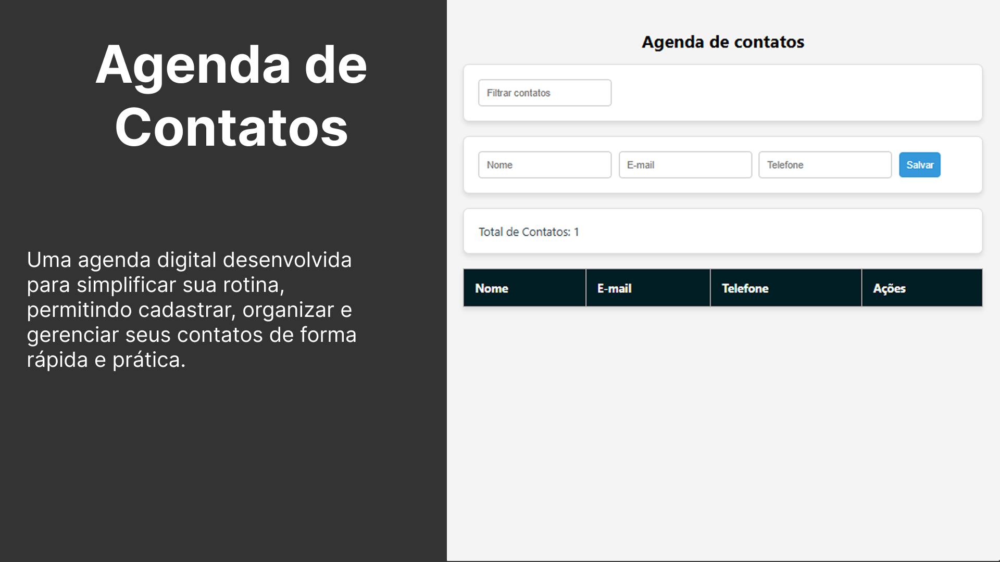

# 📒 Agenda de Contatos  

  

## 📌 Sobre o projeto  
Este projeto faz parte do curso **“JavaScript do Básico ao Avançado + 132 Projetos Reais”** do Clevison Santos.  

A proposta foi desenvolver uma **agenda digital de contatos**, onde é possível:  
- Adicionar, editar e excluir contatos  
- Armazenar os dados no **LocalStorage**, garantindo persistência mesmo ao recarregar a página  
- Filtrar contatos por nome, e-mail ou telefone  
- Exibir o total de contatos cadastrados em tempo real  
- Utilizar uma interface simples, intuitiva e responsiva  

---

## 🚀 Demonstração  
🔗 **Acesse aqui a versão online no GitHub Pages:**  
[👉 Clique para testar](https://thamiressarges.github.io/agenda-de-contatos)  

---

## 🛠 Tecnologias utilizadas  
- **HTML5**  
- **CSS3**  
- **JavaScript (ES6+)**  
- **LocalStorage**  

---

## 📖 Aprendizados  
Esse projeto foi essencial para reforçar conceitos de:  
- Manipulação do DOM  
- Eventos em JavaScript  
- Armazenamento de dados no navegador  
- Criação e renderização dinâmica de tabelas  
- Estruturação de projetos front-end  

---
